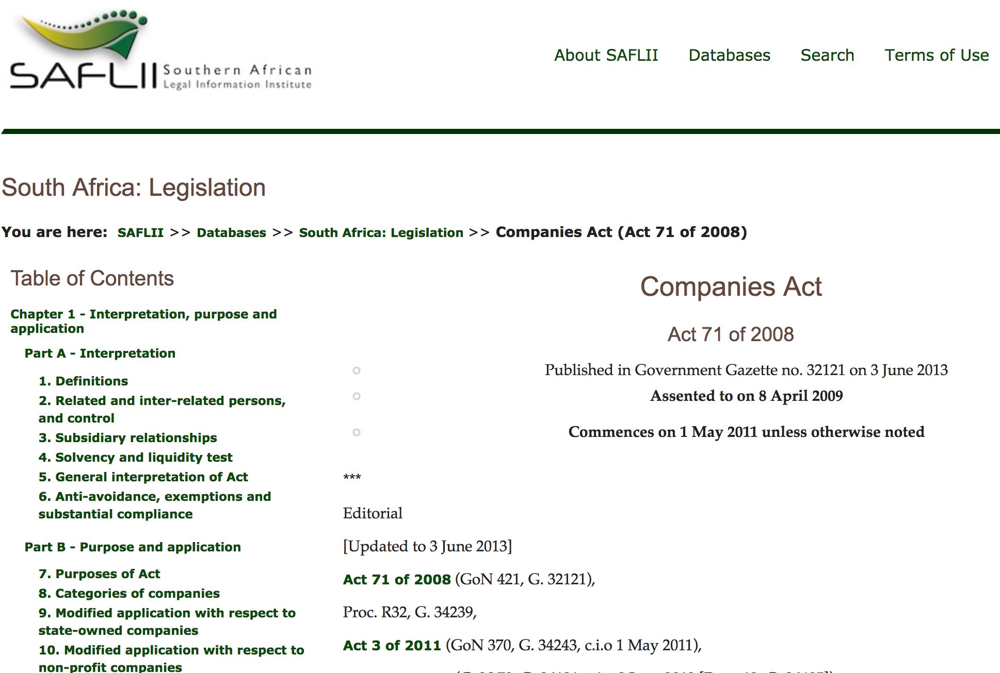
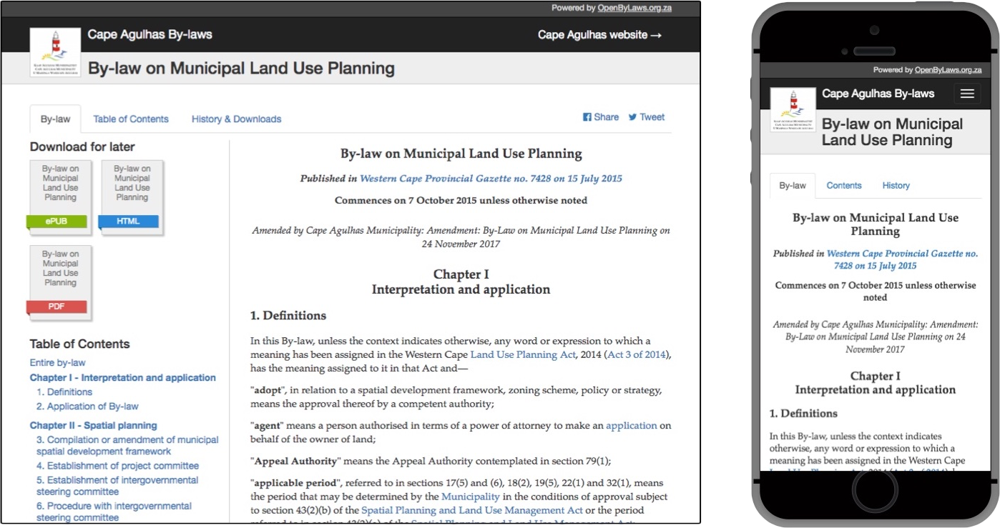

## Indigo Legislation Platform

### Greg Kempe
greg@openup.org.za

---

## Indigo

Cloud-based editor that simplifies the process of capturing, consolidating and publishing legislation

---

### Efficiently publish

legislation that is

### machine-readable
### metadata-rich
### versioned

to enable

### innovation

Notes:
  - accepted standard, best industry practice
  - productivity
  - enabler

---

also

### productivity
### diverse legal traditions
### continuous improvement

---

### National Legislation in South Africa

---

### Municipal By-laws in South Africa

---

adaptable to traditions

screenshot of polish legislation
plugin system

---

dev process

---

akn: benefits, uses, (outputs)

---

challenges with akn and its workarounds

---

target: back office, productivity, workflows

---

apis

---

wrap up
