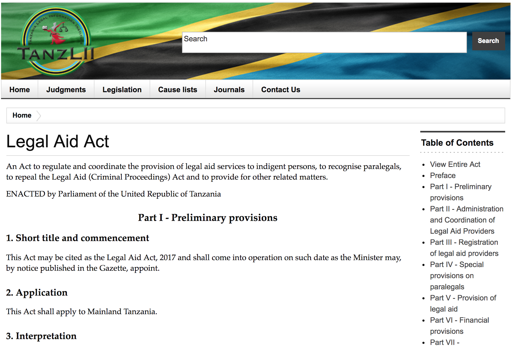
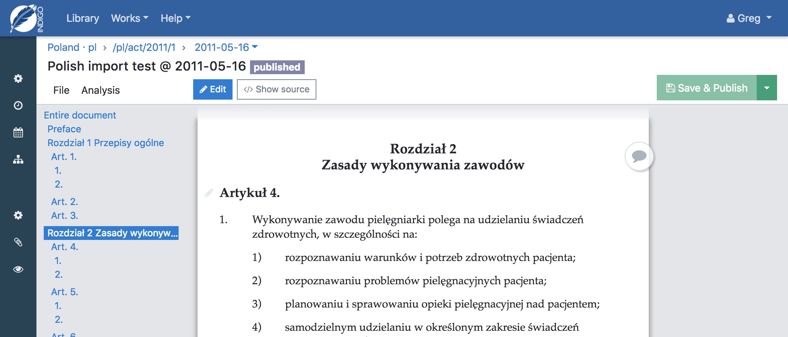

## Indigo Legislation Platform

### Greg Kempe
greg@openup.org.za

---

## Indigo

Cloud-based editor<br>that simplifies the process of<br>capturing, consolidating and publishing<br>legislation

---

<!-- .slide: data-background-image="images/process.png" data-background-size="contain" data-background-opacity="1.0" -->

---

### Efficiently publish

legislation that is

### machine-readable
### metadata-rich
### versioned

to enable

### innovation

Notes:
  - accepted standard, best industry practice
  - productivity
  - enabler

---

also

### productivity
### diverse legal traditions
### multiple languages
### continuous improvement

---

<!-- .slide: data-background-image="images/indigo-screenshot2.png" data-background-size="contain" data-background-opacity="1.0" -->

---

<!-- .slide: data-background-image="images/indigo-screenshot1.png" data-background-size="contain" data-background-opacity="1.0" -->

---

### National Legislation in South Africa


---

### National Legislation in Tanzania



---

### Municipal By-laws in South Africa


Notes: residents, staff, law enforcement

---

## Agile Development process

Consultation with expert legal editors <!-- .element: class="fragment" -->

Regular user testing, variety of experience <!-- .element: class="fragment" -->

Daily updates based on feedback <!-- .element: class="fragment" -->

Modern open source software pipeline <!-- .element: class="fragment" -->

Notes: opportunities to use tech to improve a process

---

### Adaptable to local legal traditions



Notes: plugin system

---

## ❤️ Akoma Ntoso ❤️

Foundation for rich, varied outputs:

Desktop, mobile, PDF, ePUB, ...

---

## 😱 Akoma Ntoso 😱

Complex and scary!

```xml
<blockList id="section-1.1.list15" refersTo="#term-hotel">
  <listIntroduction>"<def refersTo="#term-hotel">hotel</def>" means a property used as temporary residential accommodation for overnight guests where lodging or meals are provided for compensation, and includes:</listIntroduction>
    <item id="section-1.1.list15.a">
      <num>(a)</num>
      <p>a <term refersTo="#term-restaurant" id="trm20">restaurant</term> or restaurants forming part of a hotel;</p>
    </item>
  </listIntroduction>
</blockList>
```

---

## 😁 Akoma Ntoso 😁

### User-friendly

vs

### Expressive

vs

### Adaptable

Notes: optimised for (pdf) import

---

Indigo is for

## editing and managing

not for

## reading or using

legislation

Notes: back office, productivity, workflows

---

## Indigo<br>enables innovation

by publishing

## legislation as<br>building blocks

---

<!-- .slide: data-background-image="images/apis.png" data-background-size="contain" data-background-opacity="1.0" -->

Notes: apis

---

## Thank you

openup.org.za/indigo

greg@openup.org.za
